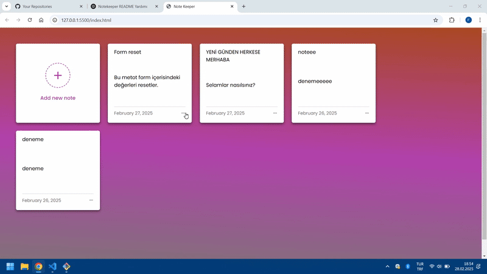

<h1>Note-Keeper </h1>

Notekeeper, kullanıcıların hızlı ve kolay bir şekilde notlar alabileceği bir uygulamadır. JavaScript kullanılarak geliştirilmiş, kullanıcı dostu bir arayüze sahip olan bu uygulama, notlarınızı kaydedip düzenlemenize olanak tanır.

<h2>Teknolojiler</h2>

JavaScript

HTML5

CSS3

<h2>Ekran Görüntüsü</h2>

<h4>Demo</h4>

https://note-keepper.vercel.app/
